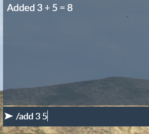

# FiveM remote call

This library helps you get data and call functions on the server from the client.

## Usage

This package assumes the following style of solution for your resource:

- MyProject (sln)
	- MyProject.Client
		- AddNumbersClient.cs
	- MyProject.Server
		- AddNumbersServer.cs
		- ExampleRemote.cs
	- MyProject.Shared
		- IExampleRemote.cs

We're going to create a chat command that adds 2 numbers using the server (you know, to save the immense calculation load on the clients)  

First, add references to the NuGet packages:
- MyProject (sln)
	- MyProject.Client
		- FiveMRemoteCall.Client
		- FiveMRemoteCall.Shared
	- MyProject.Server
		- FiveMRemoteCall.Server
		- FiveMRemoteCall.Shared
	- MyProject.Shared
		- FiveMRemoteCall.Shared

Create an interface implementing `IRemote` in your shared project, along with required request/response classes.

```csharp
// MyProject/MyProject.Shared/IExampleRemote.cs
public class AddNumbersRequest
{
	public int Number1 { get; set; }

	public int Number2 { get; set; }
}

public class AddNumbersResponse
{
	public int Number1 { get; set; }

	public int Number2 { get; set; }

	public int Result { get; set; }

	public AddNumbersResponse(int number1, int number2, int result)
	{
		Number1 = number1;
		Number2 = number2;
		Result = result;
	}
}

public interface IExampleRemote : IRemote
{
	Task<AddNumbersResponse> AddNumbers(AddNumbersRequest numbers);
}
```

It is important to note that, due to limitations of the client-side code, you **have** to make a constructor for your response object that sets the properties **in the exact same order as they're declared**. This is because certain reflection methods are not allowed on the client.

In this example, we'll be using a class `AddNumbersResponse` as a return type from the server, and `AddNumbersRequest` as a parameter type. Currently, ony 1 parameter is supported.

Now let's create our remote handler.

```csharp
// MyProject/MyProject.Server/ExampleRemote.cs

public class ExampleRemote : IExampleRemote
{
	// Tell the package that if the client wants to call a function on IExampleRemote, that this is the class that handles it.
	public Type ResolveAsType { get; } = typeof(IExampleRemote);

	public async Task<AddNumbersResponse> AddNumbers(AddNumbersRequest numbers)
	{
		// Simulate long operation
		await Task.Delay(2000);

		// Return our AddNumbersResponse object with the numbers from the client and the result
		return new AddNumbersResponse(numbers.Number1, numbers.Number2, numbers.Number1 + numbers.Number2);
	}
}
```

And finally, for the server side, create our base script.

```csharp
// MyProject/MyProject.Server/AddNumbersServer.cs
public class AddNumbersServer : BaseScript
{
	public AddNumbersServer()
	{
		// Create the RemoteCallService and pass it the EventHandlers and our IRemote implementation (ExampleRemote)
		var remoteCallService = new RemoteCallService(EventHandlers, new [] { new ExampleRemote() });
		remoteCallService.Start();
	}
}
```

Now let's create a simple command to add 2 numbers like `/add 1 2` (e.g. 1 + 2 = 3, quick maths)

```csharp
// MyProject/MyProject.Client/AddNumbersClient.cs

public class AddNumbersClient : CitizenFX.Core.BaseScript
{
	private RemoteCallService _remoteCallService;

	[CitizenFX.Core.EventHandler("onClientResourceStart")]
	private void OnClientResourceStart(string resourceName)
	{
		if (CitizenFX.Core.Native.API.GetCurrentResourceName() != resourceName)
			return;

		// Create the RemoteCallService and give it the EventHandlers object so it can register an event
		_remoteCallService = new RemoteCallService(EventHandlers);
		_remoteCallService.Start();

		// Register our chat command
		CitizenFX.Core.Native.API.RegisterCommand("add", new Action<int, List<object>, string>(CommandHandler), false);
	}

	private async void CommandHandler(int playerId, List<object> args, string rawCommand)
	{
		// Parse argument 0 and 1 from the /add X Y command
		var number1 = int.Parse(args[0].ToString());
		var number2 = int.Parse(args[1].ToString());

		// Make our request object
		var request = new AddNumbersRequest
		{
			Number1 = number1,
			Number2 = number2
		};

		// Make the remote call on the interface IExampleRemote and expect an object of type AddNumbersResponse back
		var response = await _remoteCallService.CallRemoteMethod<IExampleRemote, AddNumbersResponse>(r => r.AddNumbers(request));

		// Print the result to chat
		TriggerEvent("chat:addMessage", new
		{
			color = new[] { 255, 255, 255 },
			args = new[] { $"Added {response.Number1} + {response.Number2} = {response.Result}" }
		});
	}
}
```

And there we go!



## Supported method signatures

An example of supported signatures for methods under an `IRemote` service.

```csharp
// Sync
public void NoArgumentNoReturn()

public void ArgumentNoReturn(RequestObject argument)

public ResponseObject ReturnWithNoArgument()

public ResponseObject ReturnWithArgument(RequestObject argument)

// Async
public async Task NoArgumentNoReturnAsync()

public async Task ArgumentNoReturnAsync(RequestObject argument)

public async Task<ResponseObject> ReturnWithNoArgumentAsync()

public async Task<ResponseObject> ReturnWithArgumentAsync(RequestObject argument)
```

## Debugging

If you're running into issues, some debugging can be done by setting the following properties on the client/server respectively:
```csharp
FiveMRemoteCall.Client.Helpers.LogHelper.LogAction = Debug.WriteLine;
FiveMRemoteCall.Server.Helpers.LogHelper.LogAction = Debug.WriteLine;
```

This will write any logs from the FiveMRemoteCall package to `Debug.WriteLine`.

```
// Client
Executing remote call FiveMRemoteExample.Shared.Models.Remote.IExampleRemote.AddNumbers - 2d08337b-ebd6-4545-b374-5156c6d6f9d9
Got remote call callback - 2d08337b-ebd6-4545-b374-5156c6d6f9d9

// Server
Remove event call recieved from René - 2d08337b-ebd6-4545-b374-5156c6d6f9d9 - AddNumbers
```

## NuGet feed

```
https://nuget.pkg.github.com/Rene-Sackers/index.json
```